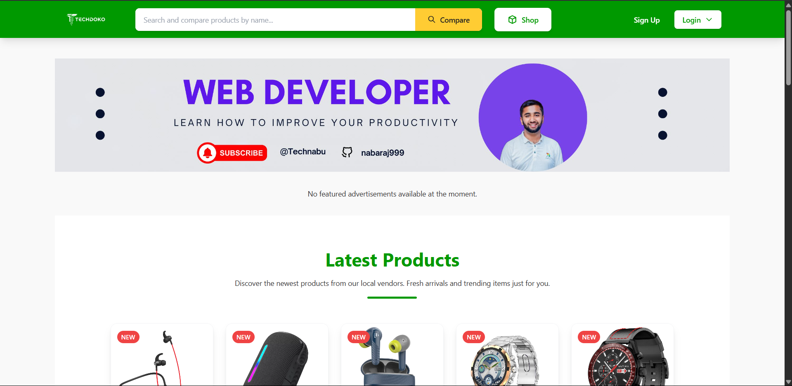

# TechDoko - Laravel E-commerce Website

TechDoko is an advanced Laravel-based e-commerce platform designed for managing and selling tech-related products.

## 🧰 Technologies Used

- Laravel 10
- Blade Template Engine
- Tailwind CSS
- JavaScript
- Filament (for admin panel)
- MySQL

## 📂 Features

- Category & Subcategory Management
- Product CRUD Operations (Add, Edit, Delete)
- Stock Management
- Discount & Offer Management
- Admin Dashboard (Filament)
- Authentication & Authorization
- Responsive Frontend Design




## 🚀 How to Run

1. Clone the repository

```bash
git clone https://github.com/yourusername/techdoko.git
cd techdoko
```

2. Install PHP dependencies

```bash
composer install
```

3. Install Node dependencies and compile assets

```bash
npm install && npm run dev
```

4. Copy `.env` file and generate key

```bash
cp .env.example .env
php artisan key:generate
```

5. Configure your `.env` with database credentials

6. Run migrations

```bash
php artisan migrate
```

7. Start local development server

```bash
php artisan serve
```

## 👨‍💻 Author

- Nabaraj Acharya  
- 🌐 [https://nabrajacharya.com.np](https://nabrajacharya.com.np)  
- 📧 support@nabrajacharya.com.np

## 🌐 Live Preview

[techdoko.nabrajacharya.com.np](https://techdoko.nabrajacharya.com.np)

## 📄 License

This project is licensed under the [MIT License](https://opensource.org/licenses/MIT).
